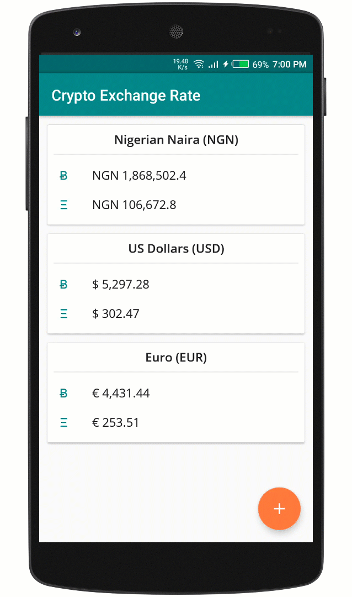

# Crypto Exchange Rate
Shows the latest exchange rate between cryptocurrencies (Bitcoin and Ethereum) and 20 major world currencies.

It also converts from any of the 20 currencies to it's equivalent in Bitcoin and Ethereum.

## Gif demo


## Running the app
The app has 2 variants: ```mockDebug``` and ```prodDebug```. 

```mockDebug``` uses a local version of the API response while the ```prodDebug``` variant fetches latest exchange rate from the [crypto compare API](https://min-api.cryptocompare.com/)

